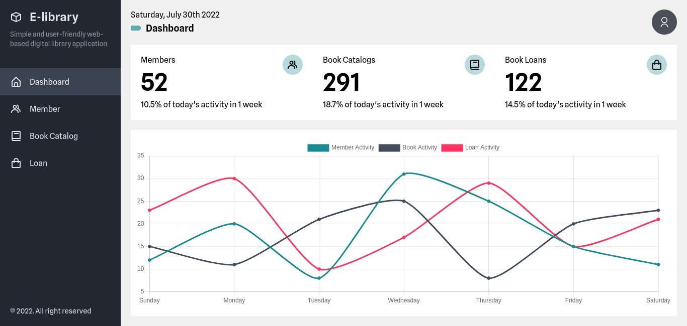
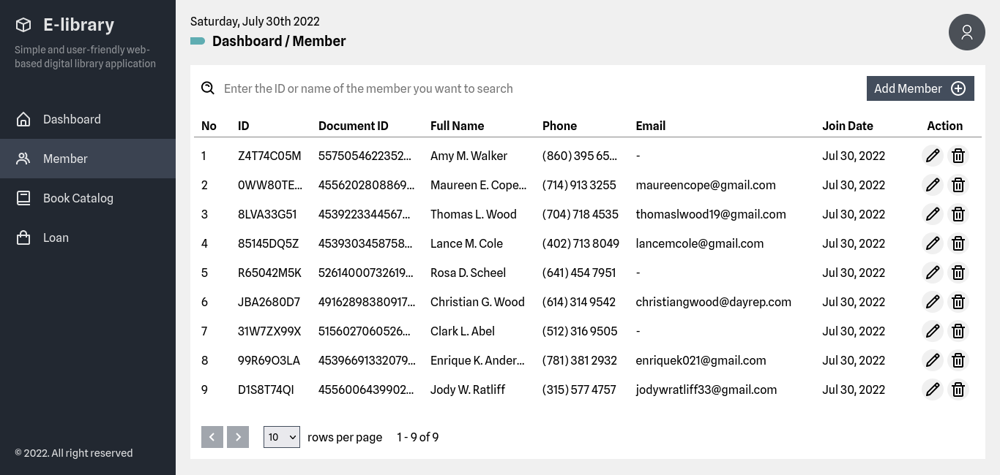
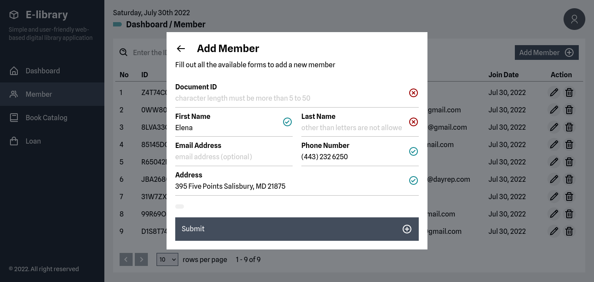
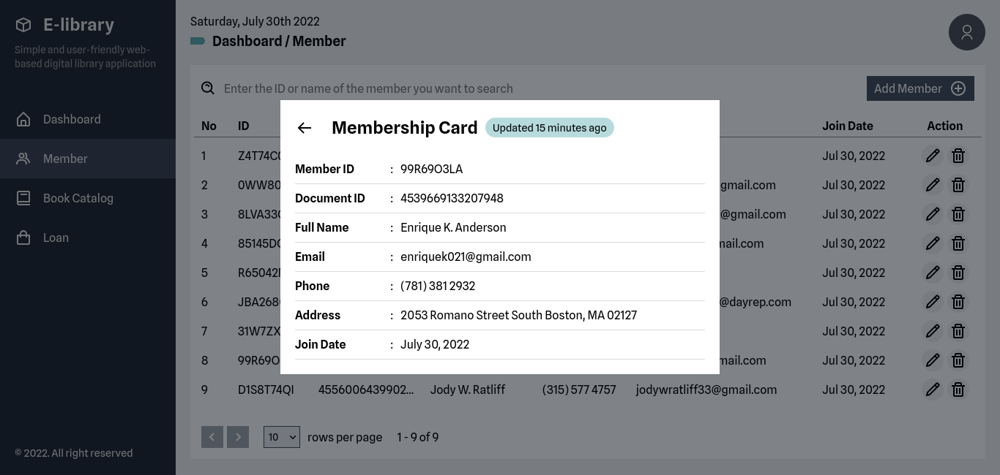
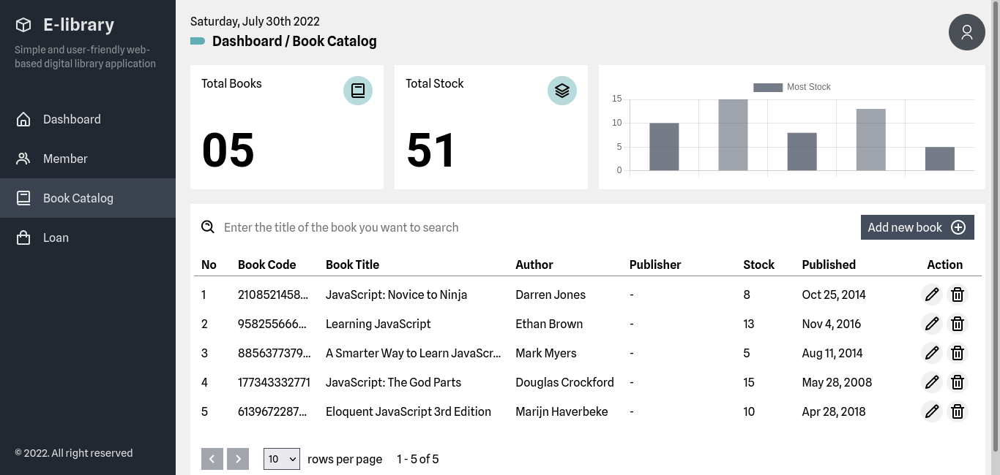
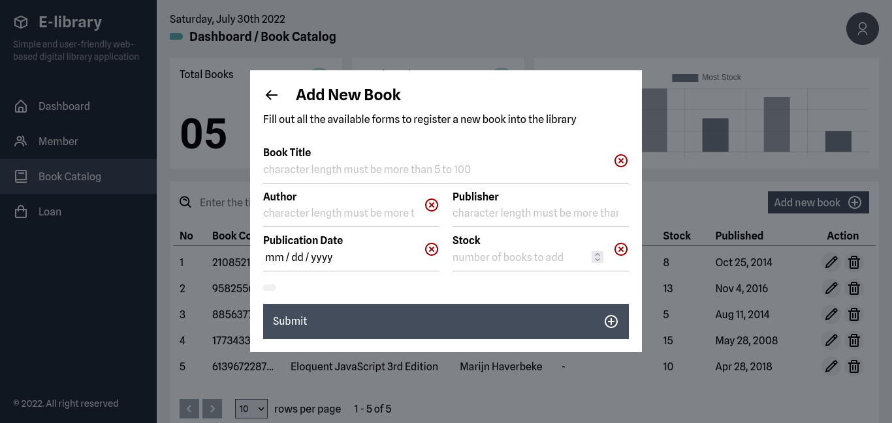
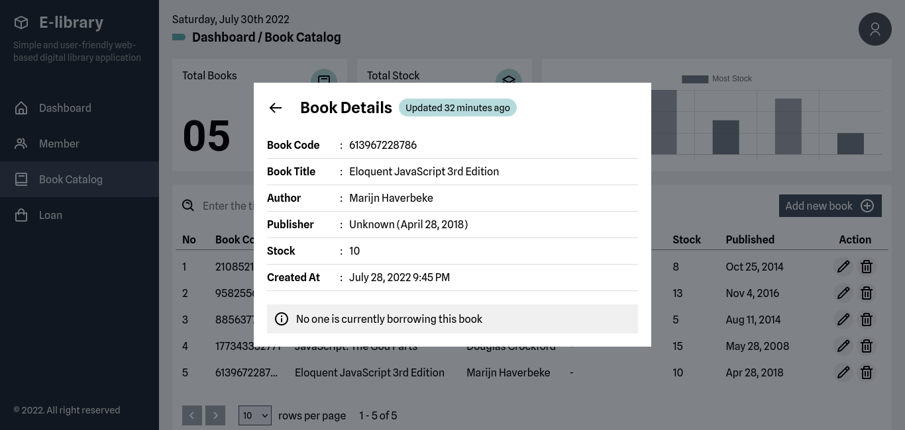
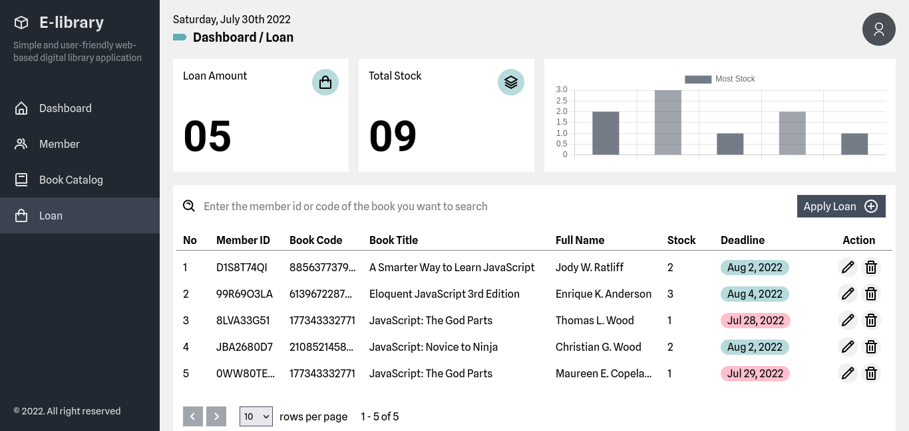
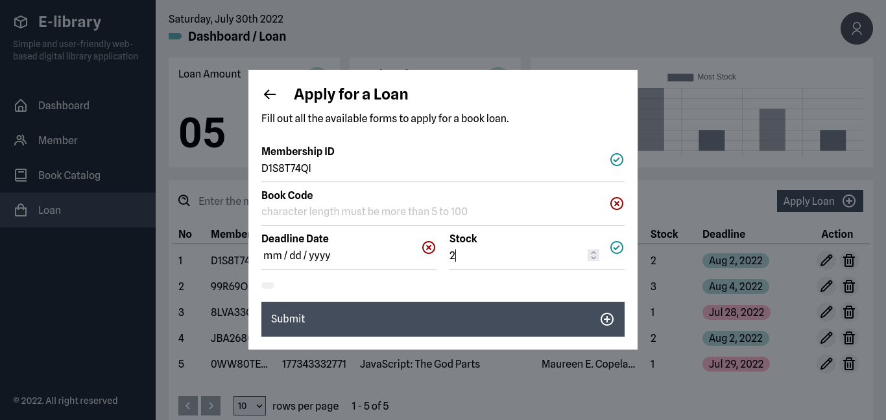
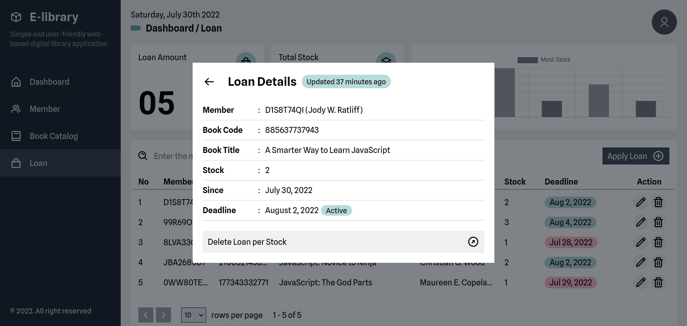

# E-Library
E-Library 📚 is a web-based digital library application service designed to facilitate data collection or library management 📋 for a campus/university, school or other agency. 🧑‍🎓

The technology stack used in this project, includes:
- [Node.js](https://nodejs.org/en) [(Express.js)](https://expressjs.com)
- [React.js](https://reactjs.org)
- [Chart.js](https://www.chartjs.org)
- [MySQL](https://www.mysql.com)
- [Sequelize](https://sequelize.org)

# Getting Started
~~~
$ mysql -u root

mysql> CREATE DATABASE elibrary;
~~~
Create your MySQL database and name it `elibrary`

~~~
$ mv .env.example .env
~~~
Rename the `.env.example` file to `.env`

~~~
$ npm install
~~~
Install all dependencies on this project.

~~~
$ npm run dev
~~~
Run the app in development mode. then open http://localhost:3000 in the browser.

# Screenshot 📸
### /dashboard

---
### /dashboard/member

---
### /dashboard/book

---
### /dashboard/loan

