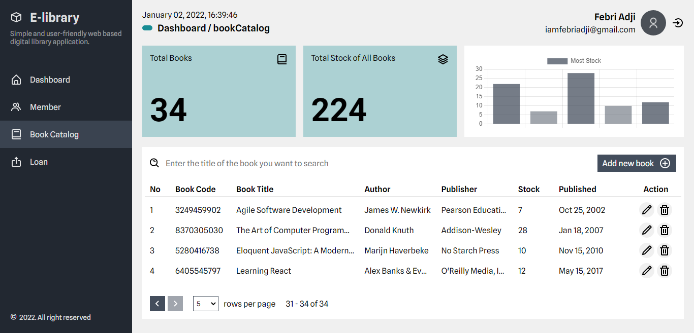
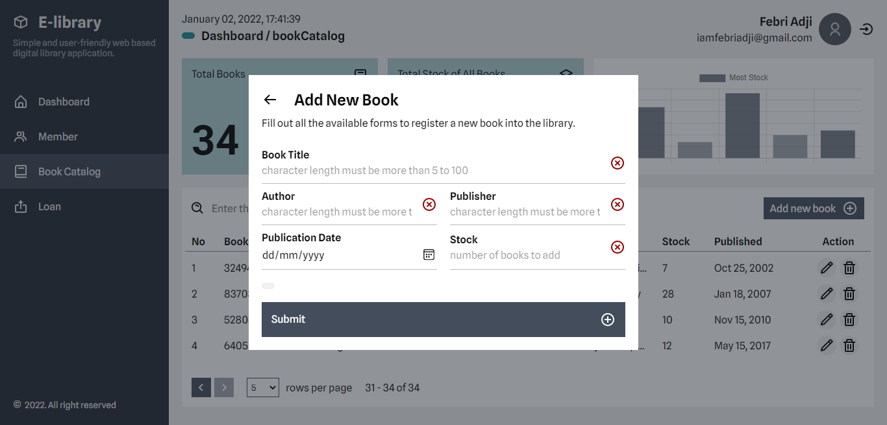
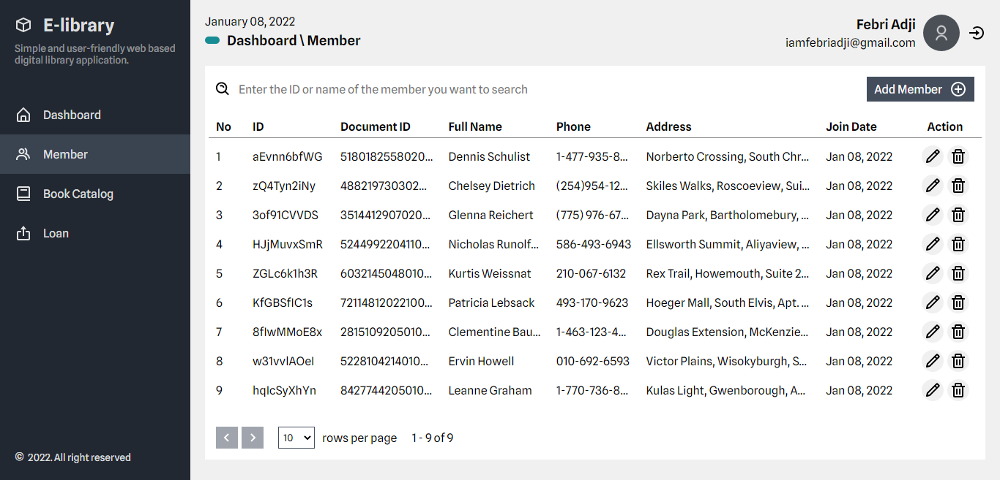
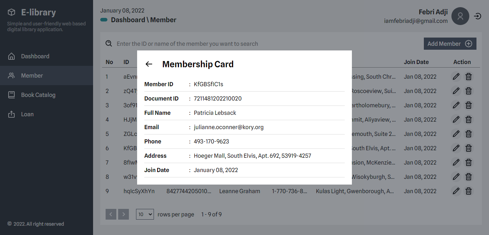

# E-Library

E-Library 📚 is a web-based digital library application service designed to facilitate data collection or library management 📋 for a campus/university, school or other agency. 🧑‍🎓

The technology stack I used on this project includes:
- [Node.js](https://nodejs.org/en) & [Express.js](https://expressjs.com)
- [React.js](https://reactjs.org) & [Redux](https://redux.js.org)
- [MySQL](https://www.mysql.com)
- [Sequelize](https://sequelize.org)

# Getting Started
~~~
$ git clone https://github.com/febriadj/e-library

$ cd e-library/ && code .
~~~
Clone this project to your local repository, then go to your project folder.

~~~
$ mv .env.example .env
~~~
Rename the `.env.example` file to `.env`

~~~
$ npm install
~~~
Install all dependencies on this project.

~~~
$ npm run dev
~~~
Run the app in development mode. then open http://localhost:3000 in the browser.

# Screenshot 📸

# Contributing
Contributions make the open source community a great place to learn, inspire and create. I really appreciate every contribution you make.

If you have any suggestions that would make this even better, please fork  this repo and pull request. You can also open an issue on this project and don't forget to give this project a star. Thank you.

- Fork this project
- Create a new branch (git checkout -b branchName)
- Commit your changes (git commit -m "Add new features")
- Push to your branch (git push origin branchName)
- Submit a pull request

# License 📄
Distributed under the MIT License. See [LICENSE.txt](https://github.com/febriadj/e-library/blob/master/LICENSE) for more information.

# Contact
LinkedIn: [linkedin.com/in/febri-adji](https://www.linkedin.com/in/febri-adji)

Phone: +62 851-5670-3982\
Email: <iamfebriadji@gmail.com>
